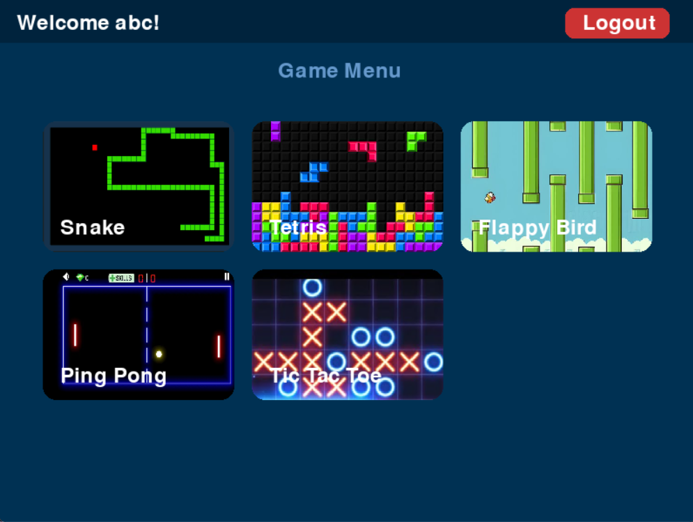
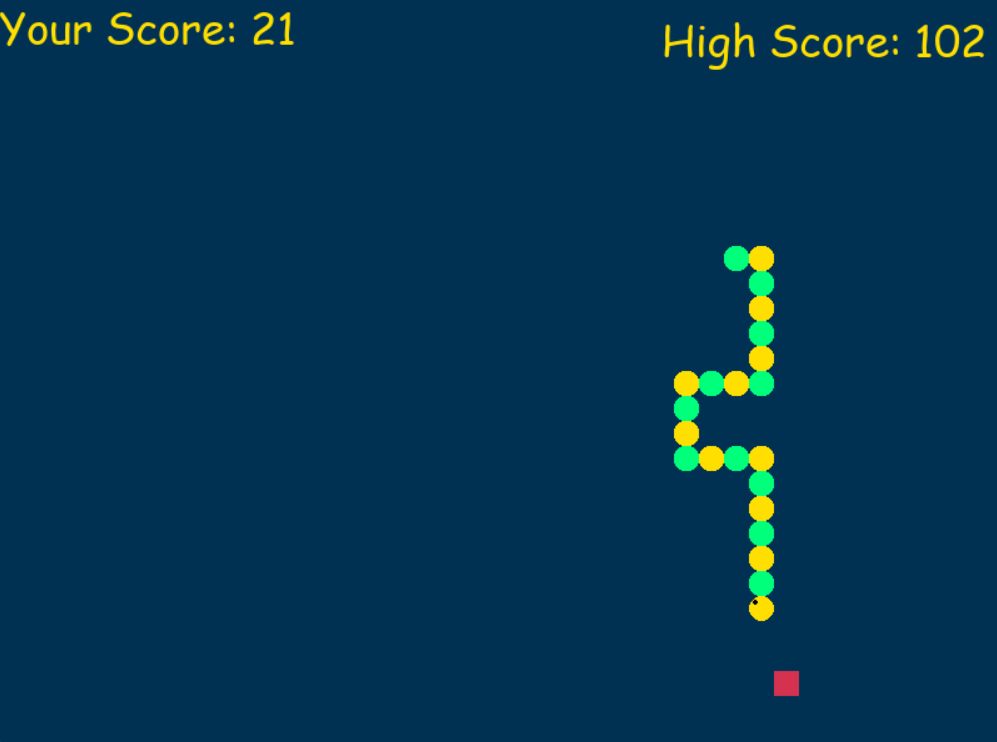
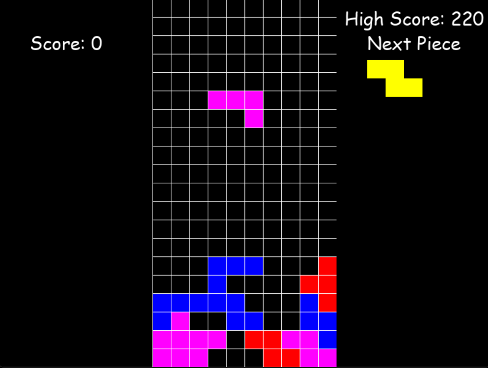
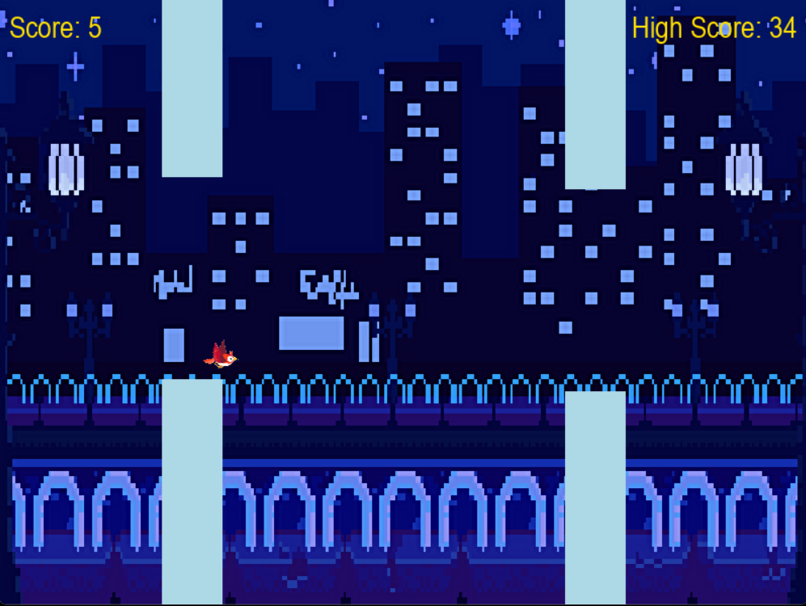
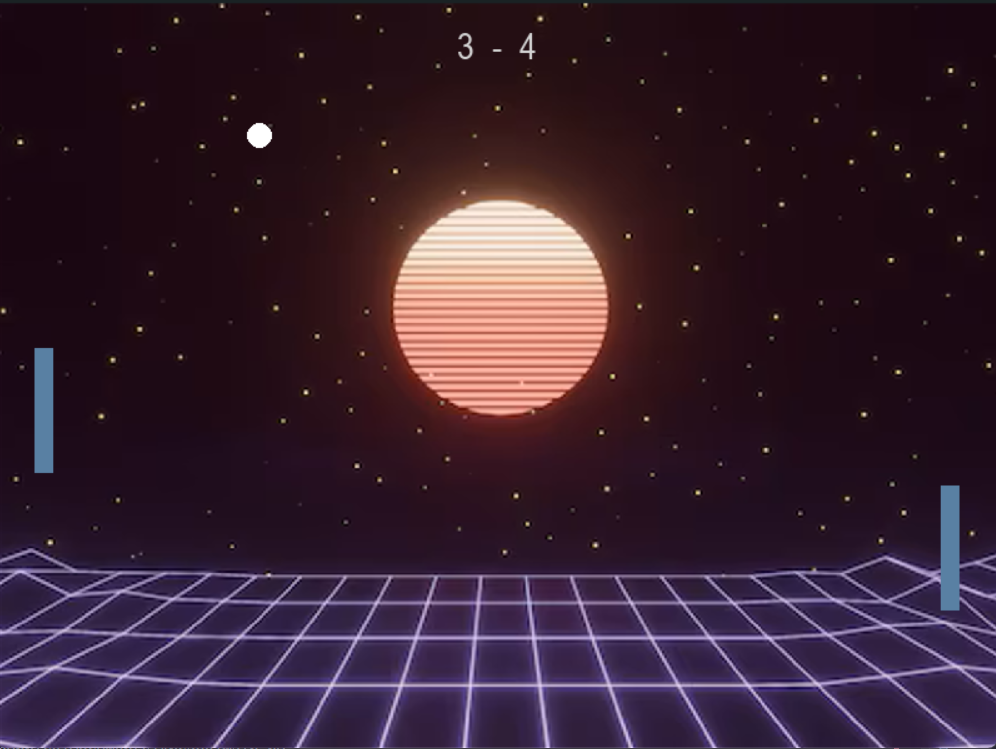
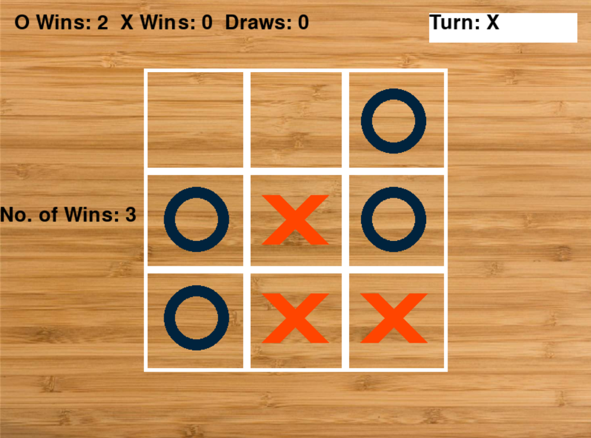

# Arcade: Game Collection

Welcome to the **Arcade**! This app brings together the most popular vintage arcade games in one place, allowing users to relive the nostalgia of classic gaming. Built using Python and Pygame, this collection includes timeless favorites such as Snake, Tetris, Flappy Bird, Ping Pong, and Tic Tac Toe.

## Features

- **Multiple Games**: Enjoy a variety of classic arcade games.
- **User Authentication**: Create accounts and log in to save your progress and high scores.
- **High Score Tracking**: Compete with yourself and others by tracking high scores for each game.
- **Graphical Interface**: Experience visually appealing and interactive gameplay.
- **Data Persistence**: User data and high scores are saved between sessions.

## Games Included

1. **Snake**
2. **Tetris**
3. **Flappy Bird**
4. **Ping Pong**
5. **Tic Tac Toe**

## Screenshots













## Installation

1. **Clone the repository**:
    ```sh
    git clone https://github.com/Vinubrice/arcade.git
    cd arcade
    ```

2. **Install the required dependencies**:
    ```sh
    pip install -r requirements.txt
    ```

3. **Run the application**:
    ```sh
    python main.py
    ```

## How to Play

1. **Launch the application**:
    ```sh
    python main.py
    ```

2. **Log in or create a new account**.
3. **Select a game** from the game menu.
4. **Enjoy playing** your favorite vintage arcade games!

## Contributing

We welcome contributions! If you have any suggestions or improvements, feel free to create a pull request or open an issue.

## License

This project is licensed under the GNU Affero General Public License v3.0. See the LICENSE file for details.

## Acknowledgements

- **Pygame**: For providing the game development library.
- **OpenGameArt**: For providing free game assets.

---

Enjoy the nostalgia of classic arcade gaming with the Arcade Game Collection!